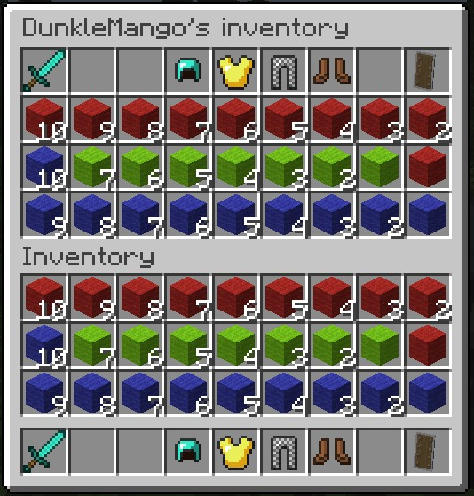
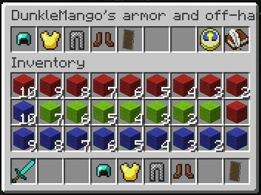
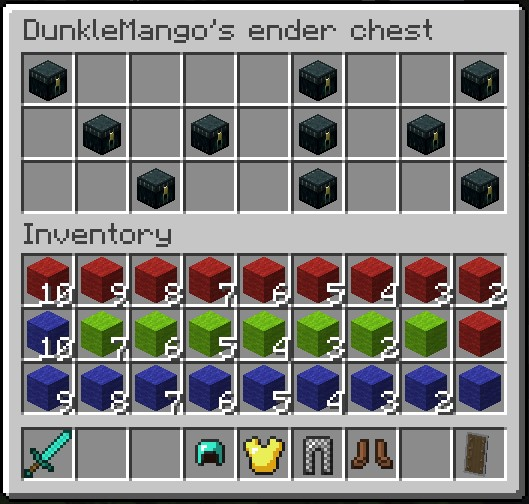

# InventoryAccess
A Sponge plugin that enables the access of other players inventories.

Currently, the following inventories can be accessed:
- player inventory - containing the hotbar and main inventory of the player
- armor inventory - containing the armor and off-hand items of the player
- ender chest - containing the ender chest inventory of the player

## Commands
When using a command, you have to replace `<target-player-name>` with the name of the player whose inventory you want to open. A player name can be entered in the form:
```
Steve
```
or with quotes like:
```
"Alex"
```
___
To access the player inventory of the target player, use the command:
```
/invacc -i <target-player-name>
```

To access the armor inventory of the target player, use the command:
```
/invacc -a <target-player-name>
```

To access the ender chest of the target player, use the command:
```
/invacc -e <target-player-name>
```
## Inventories
### Player inventory
The player inventory view is split into two inventories.
The lower inventory is your own player inventory and its layout is known.
The upper inventory is the targets player inventory.
The hotbar of the target player is located on the top of the upper inventory.
The inventory of the target player is placed below the hotbar.



___

### Armor inventory
The player inventory view is split into two inventories.
The lower inventory is your own player inventory and its layout is known.
The upper inventory is the targets armor inventory.

The Slots of the inventory are used as follows:
1. Helmet
2. Chestplate
3. Leggings
4. Boots
5. Off-Hand
6. Slot not used and items placed here will be lost.
7. Slot not used and items placed here will be lost.
8. *update* - updates the inventory from the target players equipment (any item placed in slots 1-5 will be lost)
9. *save* - equips the target player with the equipment from slots 1-5 



___

### Ender chest
The player inventory view is split into two inventories.
The lower inventory is your own player inventory and its layout is known.
The upper inventory is the targets ender chest.
The orientation of the ender chest is not changed.



## Permissions
To enable the access to any of the above mentioned commands, add the following permission to the list of permissions for the specified user group:
```
inventoryaccess.command.invacc
```

## Additional information
Changes to the inventories may not be immediately viewable in some cases.
However, they should be realized immediately.
The view of the inventory / armor should update when:
- the player closes the inventory
- the player tries to click on an item that is no longer there